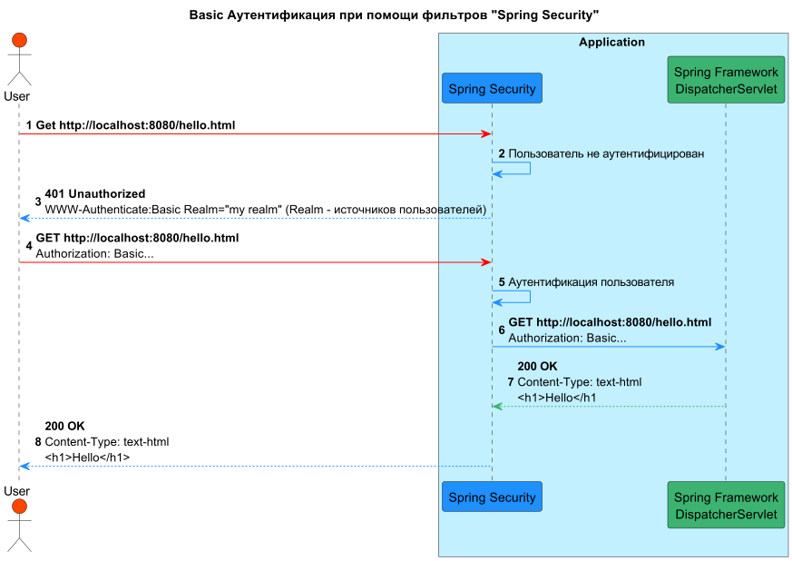
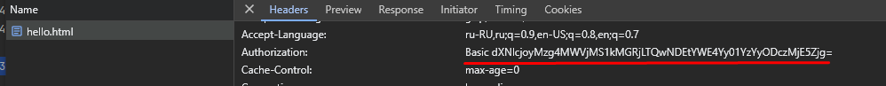

# Spring Security в деталях

Изучаем Spring Security по циклу видео https://www.youtube.com/playlist?list=PLs_aLxm3VDLu9ghcQhTHOT84zmqLgAwdL

## Общий механизм аутентификации и авторизации

## Принцип работы Spring Security

В приложении на основе Servlet API, прежде чем запрос будет обработан сервлетом, он должен пройти через цепочку
фильтров, каждый из которых может модифицировать запрос и ответ, а так же при необходимости приостанавливать обработку
запроса.
SpringSecurity предоставляет механизм когда можно внедрить свои проверки в фильтры перед передачей запроса источнику,
или написание собственных фильтров
Spring Security использует фильтры, зарегистрированные в контексте приложения Spring, и которые недоступны
сервлет-контейнеру. Чтобы сервлет-контейнер мог использовать фильтры Spring Security, в приложении необходимо
зарегистрировать компонент класса DelegatingFilterProxy, который является связующим звеном между сервлет-контейнером и
контекстом приложения Spring. Если вы используете Spring Boot, то этого делать не надо — разработчики Spring Boot уже
заранее сконфигурировали интеграцию Spring Security за вас.
Если запрос в процессе фильтрации успешно проходит все фильтры, то он достигает своей цели — сервлета, который сможет
его обработать, в случае со Spring Framework это будет DispatcherServlet.

### Basic аутентификация

При Basic аутентификации в запросе в заголовке Authorization передается логин и пароль в Base64
